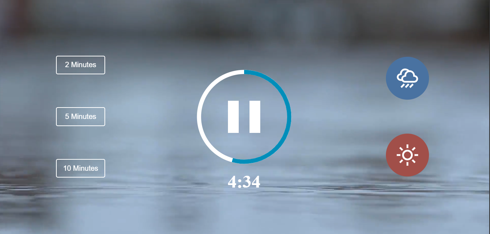

# Meditation-app

This is a meditation sounds app that the user can enjoy by picking the amount of time to listen to and choose different ambient sounds.

## Table of contents

- [Overview](#overview)
  - [Screenshot](#screenshot)
  - [Links](#links)
- [My process](#my-process)
  - [Built with](#built-with)
  - [What I learned](#what-i-learned)
- [Author](#author)

## Overview

### Screenshot

### Links

- Live Site URL: [Meditation App](https://mdanieladla.github.io/meditation-app/)

## My process

### Built with

- Semantic HTML5 markup
- CSS custom properties
- Flexbox
- Javascript

### What I learned

With this challenge I have improved my layout skills (HTML5, CSS3) and basic JS.
This is the first version of the meditation app, the next version is gonna include a mobile version.

## Author

- Website - [Daniela Darnea](https://mdanieladla.github.io/portfolio/)
- LinkedIn - [Maria Daniela Darnea](https://www.linkedin.com/in/mdanielad/)
